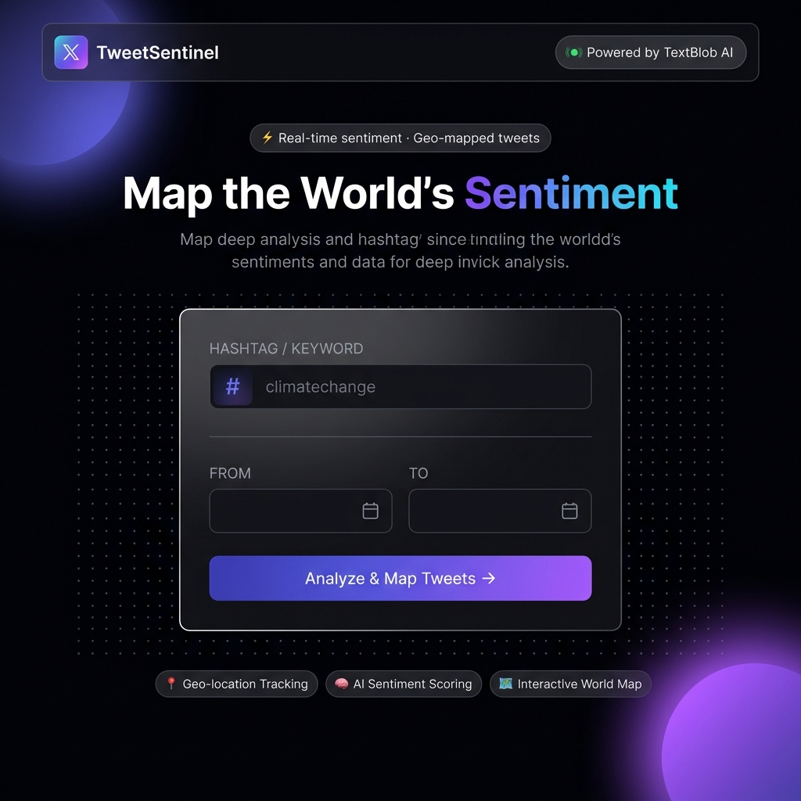
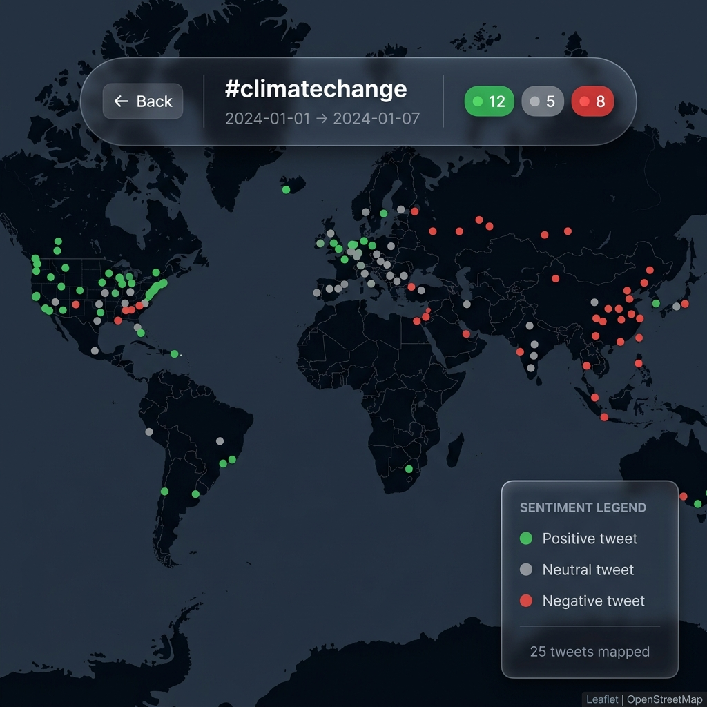

# 🛰️ TweetSentinel

**Map the World's Sentiment in Real-Time.**

TweetSentinel is a tool that analyzes the collective mood of the planet. By harnessing the power of the Twitter API and TextBlob AI, it scrapes geolocated tweets, scores their sentiment, and plots them on an interactive, high-fidelity world map.



## ✨ Features

- 🧠 **AI-Powered Sentiment Analysis**: Leverages TextBlob to classify tweets into Positive, Neutral, or Negative.
- 📍 **Precision Geo-Mapping**: Plots tweets based on precise GPS coordinates or user-profile locations.
- 🗺️ **Interactive HUD**: A full-screen dark map experience with a floating glassmorphism dashboard.
- 💎 **Luxury Design System**: Built with a 21st.dev-inspired dark aesthetic, featuring ambient glows, dot grids, and frosted glass components.
- ⚡ **Real-Time Visualization**: Watch public opinion light up across the globe as data is fetched.

## 🛠️ Tech Stack

- **Backend**: Python, Flask
- **Analysis**: TextBlob (Natural Language Processing)
- **Mapping**: Folium, Leaflet.js, CartoDB Dark Matter
- **API**: Tweepy (X/Twitter API)
- **Frontend**: Vanilla HTML5, CSS3 (Modern Glassmorphism), ES6 Javascript

## 🚀 Getting Started

### 1. Prerequisites
Ensure you have Python 3.12+ installed.

### 2. Installation
Clone the repository and set up a virtual environment:

```bash
# Create virtual environment
python3 -m venv .venv

# Activate (bash/zsh)
source .venv/bin/activate

# Install dependencies
pip install flask textblob folium tweepy geocoder
```

### 3. Configuration
Open `app.py` and insert your Twitter/X API credentials:

```python
CONSUMER_KEY        = 'YOUR_KEY'
CONSUMER_SECRET     = 'YOUR_SECRET'
ACCESS_TOKEN        = 'YOUR_TOKEN'
ACCESS_TOKEN_SECRET = 'YOUR_TOKEN_SECRET'
```

### 4. Launch
```bash
python app.py
```
Visit `http://localhost:5000` to start mapping.

## 📸 Interface Preview



## ⚖️ Sentiment Scoring

The map uses a clear color-coded system to represent public mood:
- 🟢 **Green**: Positive sentiment
- ⚫ **Gray**: Neutral / Objective information
- 🔴 **Red**: Negative sentiment

---

**Designed & Developed by [Farhan Ahmed](https://linkedin.com/in/itsfarhan)**
